# izmirim-Kart-
I made Analyses and Visualizations about Izmirim Card Usage Statistics

# Table of contents

<a href="#1">1. Data </a> 

<a href="#2">2. İzban </a> 

<a href="#3">3.  Metro </a>  

<a href="#4">4. Eshot </a> 

<a href="#5">5. Comparison between public transport means </a>

<a href="#6">6. Findings </a> 

## 1. Data

Izmir Metropolitan Municipality has an <a href="https://acikveri.bizizmir.com/">Open Data Portal </a>

In this portal you can find some datas about Izmir 

I used <a href="https://acikveri.bizizmir.com/tr/dataset/izmirim-kart-kullanim-istatistikleri">İzmirim Kart Kullanım İstatistikleri Dataset </a> in this project .

This data set includes data on how many daily passenger types (Full ticket, student...) are used by many public transportation vehicles such as Metro, tram, suburban stations, ferry port turnstiles, all bus boardings, Bisim, Teleferik in Izmir.

## 2. İzban

- İzban Usage in 2021

  

    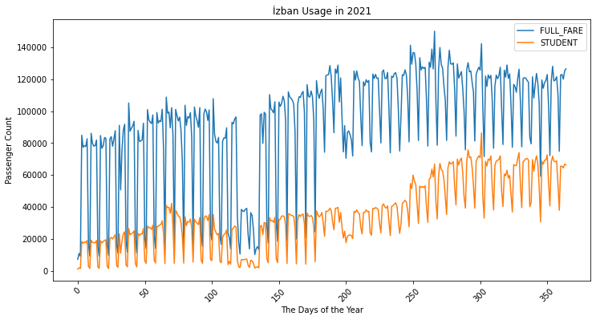
  

There are some sharp declines in graph betwwen the 110.day and 135.day because of coronavirus outbreak

Due to the coronavirus outbreak, there was a full closure that started at 19.00 on Thursday, April 9, 2021, and lasted until 05.00 in the morning on Monday, May 17, 2021.

-  İzban Usage in 2022

  

    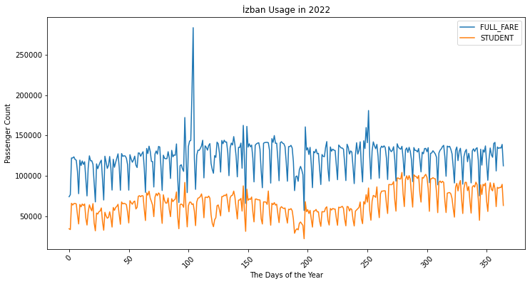
  

  
-  İzban Usage in 2023

  

    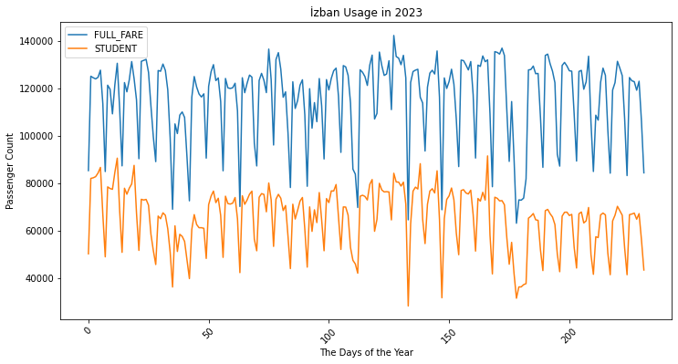
  

  
-  2021 vs 2022 for İzban ("Full Fare")

  

    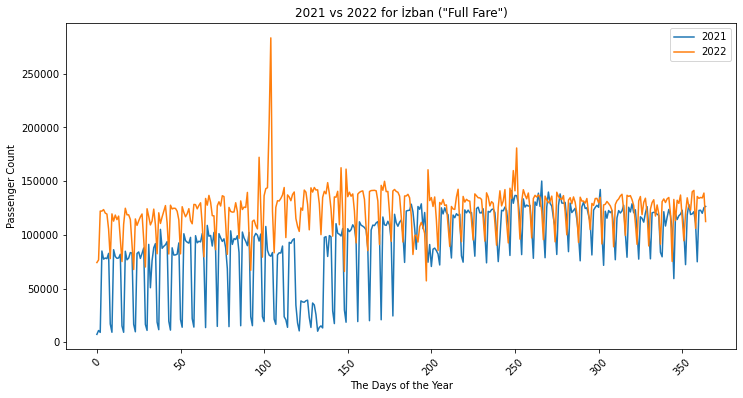
  

-  İzban Usage in 2022 by Months

  

    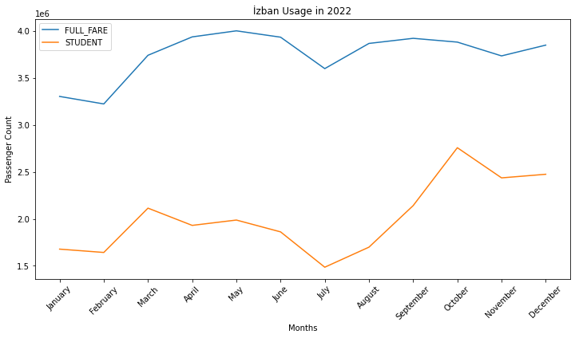
  

## 2. Metro

-  Metro Usage in 2021

  

    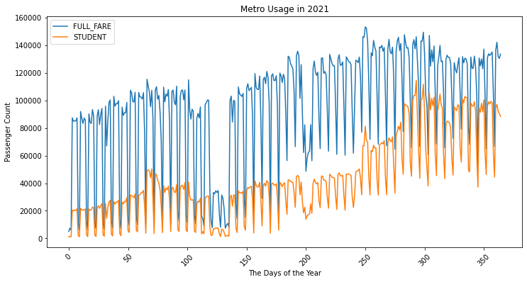
  

There are some sharp declines in graph betwwen the 110.day and 135.day because of coronavirus outbreak

Due to the coronavirus outbreak, there was a full closure that started at 19.00 on Thursday, April 9, 2021, and lasted until 05.00 in the morning on Monday, May 17, 2021.

-  Metro Usage in 2022

  

    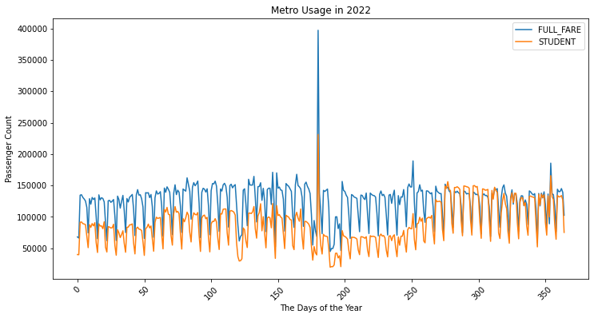
  

-  Metro Usage in 2023

  

    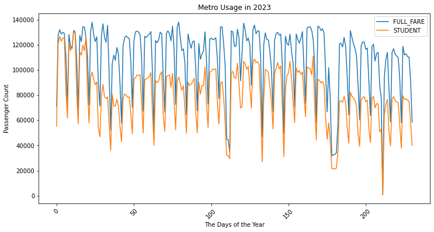
  

- 2021 vs 2022 in Metro

 

    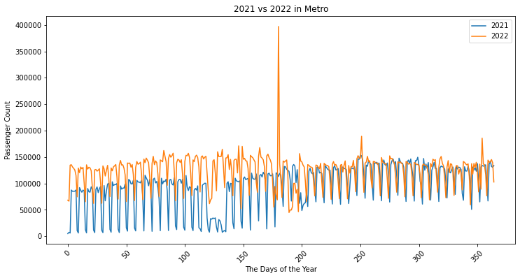
  

## 4. Eshot

- Eshot usage in 2021

  

    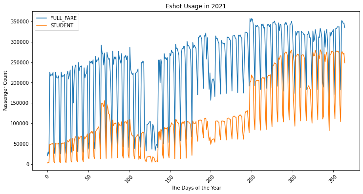

- Eshot usage in 2022

  

    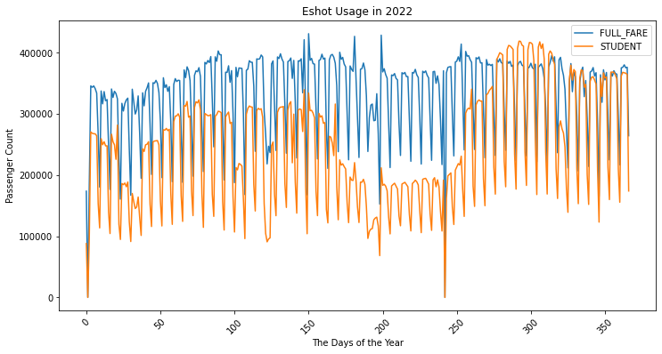

- Eshot usage in 2023

  

    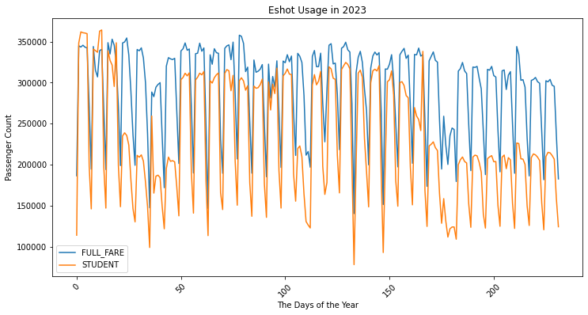

- 2021 vs 2022 For Eshot

- 

    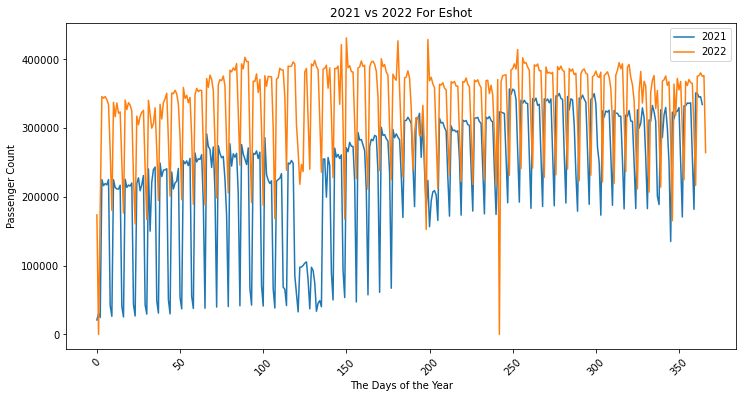

## 4. Comparison between public transport means

- İzban VS Metro in 2021

- 

    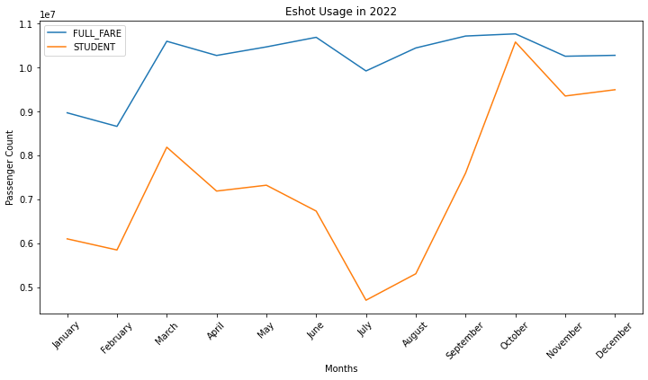

